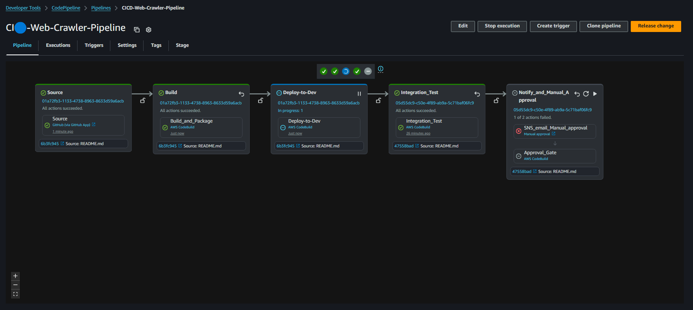
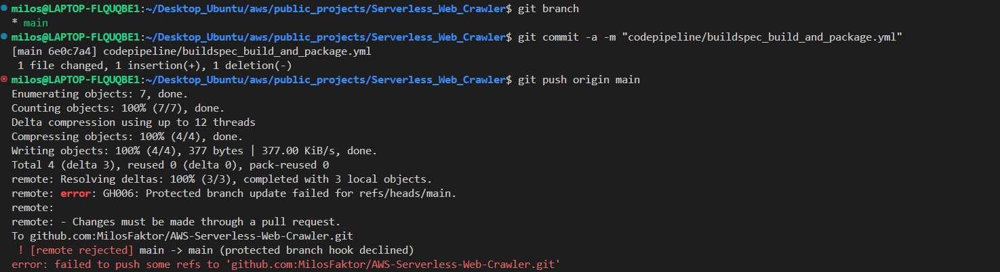
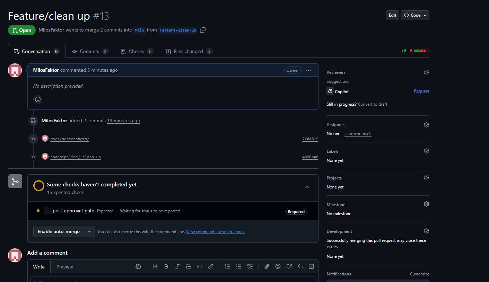

# 🚀 Serverless Web Crawler – v3.0.0 CI/CD Pipeline

This release documents the **CI/CD pipeline** built for the Serverless Web Crawler project, using **AWS CodePipeline, CodeBuild, SAM**, and **GitHub Flow** with **branch protection + status checks**.

---

### Do you want to see all screenshots from the project?  
👉 [All screenshots](docs/screenshots/)

### Want the full build journey with errors, fixes, lessons, and AWS tweaks?  
👉 [BUILD-JOURNAL.md](docs/BUILD-JOURNAL.md)

---

## 📋 CI Pipeline Overview

| Step | Name | Purpose |
|------|------|---------|
| 1 | **Source** | Trigger from GitHub Pull Request events |
| 2 | **Build & Package** | Validate & package SAM application artifacts |
| 3 | **Deploy to Dev** | Deploy packaged stack to development environment |
| 4 | **Integration Testing** | End-to-end functional tests across AWS services |
| 5 | **Manual Approval + Status Check** | Human gate + enforce GitHub merge protection |

---

## 🔹 CI – Step 1: Source (Pull Request Event Webhook)

### What I Did
- Connected CodePipeline to GitHub using an AWS CodeStar Connections integration (GitHub App authentication).
- Triggered from **pull request events** (not direct pushes).
- Filtered **destination branch** to `main`.
- Selected PR events:
  - **Created** (PR opened)
  - **Updated** (commits pushed to PR’s source branch)
- Left **Closed** unselected.

### Key Learnings
- PR event filtering is **destination-based**, not source-based.
- Once a PR is open, commits to the feature branch trigger CI automatically.
- Filtering to only “Created” & “Updated” keeps pipeline clean.

### Challenges & Fixes
- ❌ Pipeline didn’t trigger on feature branch commits initially.
- ✅ Fixed by setting destination branch filter to `main`.

**Outcome:** CI starts automatically for any PR → main.

---

## 🔹 CI – Step 2: Build & Package (CodeBuild)

### What I Did
- Minimal `buildspec.yml` that:
  1. Validates the SAM template.
  2. Runs `sam build` → `.aws-sam/build/`.
- Exported only required artifacts for later stages.

### Why Split Build & Deploy
- **One SAM template** for all environments, controlled by `STAGE=dev|prod`.
- Deploy stage injects env-specific params at runtime without rebuilding.

### Key Learnings
- Artifacts = “handoff contract” for later stages.
- Clean rebuilds keep template/code in sync.
- Using preinstalled runtimes saved ~30s build time.

---

## 🔹 CI – Step 3: Deploy to Dev

### What I Did
- Dedicated `deploy.sh` script:
  - Validates stack status before deploy.
  - Deletes failed stacks automatically.
  - Runs `sam deploy` with env-specific settings.
  - Saves CloudFormation outputs (full + simplified JSON).

### Challenges
- **IAM Permissions:** Separate Dev/Prod roles.
- Handling **ROLLBACK** states without blocking future deploys.

**Outcome:** Dev stack deployed cleanly, ready for integration testing.

---

## 🔹 CI – Step 4: Integration Testing

### Purpose
Full end-to-end verification that:
1. Initiator Lambda → SQS → Crawler Lambda → DynamoDB works as expected.

### What Happens
- Load stack outputs from artifacts.
- Invoke Initiator Lambda with `fileb://` payload.
- Wait 30s before polling SQS (avoids race conditions).
- Poll SQS until empty (with 3 consecutive empty checks).
- Scan DynamoDB table → must have ≥1 record to pass.

### Challenges
- Missing artifacts between stages → fixed by explicit artifact listing.
- `fileb://` vs `file://` payload encoding.
- Timing logic to avoid false negatives.

**Outcome:** Reliable functional gate before production.

---

## 🔹 CI – Step 5: Manual Approval, SNS Notification & GitHub Status Check

### What I Did
- Added **Manual Approval** action.
- Linked to **SNS topic** → email notification with:
  - Link to PR
  - Link to CodePipeline approval page
- Added post-approval CodeBuild job:
  - Posts `"success"` to GitHub Status API.
  - Uses `GITHUB_TOKEN` from Secrets Manager.

### How it Works
- PR → Build → Deploy → Test → **Approval** → Status Check → Merge
- **Merge button locked** until:
  1. Pipeline passes.
  2. Manual approval given.
  3. Status check posts successfully.

---

## 🔹 GitHub Flow + Branch Protection

### What I Did
- Adopted **GitHub Flow**:
  - `main` = production-ready, protected.
  - `feature/*` = development branches.
- Branch protection rules (even for admins):
  - No direct commits to main.
  - All changes via PR.
  - PR merges allowed **only if status checks pass**.
- Status checks posted **from the pipeline** after tests + manual approval.

### Why This Matters
- Eliminates human error.
- Enforces discipline at the platform level.
- Prevents accidental or untested merges into production.

**Outcome:**  
Production is **always in a known good state**. Mistakes are impossible by default, not just discouraged by policy.

### Pipeline in progress with previous rejected manual approval

---

## ✅ Final Flow Diagram
- feature/* → Pull Request → CI Pipeline:
    1. Source
    2. Build & Package
    3. Deploy to Dev
    4. Integration Tests
    5. Approval + Status Check
    → Merge to main → CD Pipeline → Production

---

## 📦 Skills & Knowledge Demonstrated
- GitHub Flow + Branch Protection Rules
- AWS CodePipeline / CodeBuild multi-stage CI
- SAM packaging & deployment strategies
- Integration testing in CI/CD with async AWS services
- GitHub Status API integration with AWS
- Secure token management via AWS Secrets Manager
- SNS notifications in pipeline workflows

---

## Screenshots

 

---

## 👤 Author
Milos Faktor — [LinkedIn](https://www.linkedin.com/in/milos-faktor-78b429255/)

Built and tested in Denmark, shared with the world.

---

### Want the full build journey with errors, fixes, lessons, and AWS tweaks?  
👉 [BUILD-JOURNAL.md](docs/BUILD-JOURNAL.md)

### Do you want to see all screenshots from the project?  
👉 [All screenshots](docs/screenshots/)

### Hashtags
#AWS #CodePipeline #CodeBuild #AWSSAM #CI_CD #DevOps #GitHubFlow #BranchProtection #StatusChecks #InfrastructureAsCode #Serverless #Lambda #SQS #DynamoDB #CloudWatch #SecretsManager #Automation #GitHubActions #CloudComputing #SoftwareArchitecture #WebCrawler
