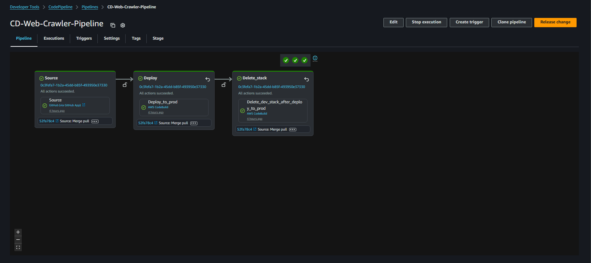

# 🚀 Serverless Web Crawler – v3.0.0 CD Pipeline

This release documents the **CD pipeline** built for the Serverless Web Crawler project, using **AWS CodePipeline, CodeBuild, SAM**, and artifact promotion from the CI pipeline.

---

### Do you want to see all screenshots from the project?  
👉 [All screenshots](docs/screenshots/)

### Want the full deployment journey with errors, fixes, lessons, and AWS tweaks?  
👉 [DEPLOY-JOURNAL.md](docs/DEPLOY-JOURNAL.md)

---

## 📋 CD Pipeline Overview

| Step | Name | Purpose |
|------|------|---------|
| 1 | **Source** | Trigger on push to `main` after CI success |
| 2 | **Deploy to Prod** | Deploy the exact artifacts tested in Dev |
| 3 | **Delete Dev Stack** | Clean up resources & avoid cost drift |



---

## 🔹 CD – Step 1: Source (Push to Main Trigger)

### What I Did
- Configured AWS CodePipeline (CD) to **trigger only on push events to the `main` branch**.
- This stage runs only after:
  1. CI pipeline completes successfully.
  2. Manual approval is granted.
  3. GitHub Status Check passes.
- Authentication via **GitHub App** (same as CI) for secure integration.

### Key Learnings
- CI and CD separation is critical:
  - CI = validate & approve code.
  - CD = deploy already approved code.
- Push-to-main trigger guarantees production uses a **known good commit**.

### Outcome
- Acts as the **entry point** for production deployment.
- Ensures only tested, approved, and reviewed code reaches production.

---

## 🔹 CD – Step 2: Deploy to Production

### What I Did
- Reused the same **`deploy.sh`** and **`buildspec-deploy.yml`** as the Dev stage in CI.
- Changed environment variables to target `prod`:
  - `Environment=prod`
  - `STACK_NAME=serverless-webcrawler-$Environment`
  
- Used a **separate IAM role** for production with stricter permissions.
- Fully automated `sam deploy --no-confirm-changeset`.

### Key Learnings
- **Artifact promotion**: Used Dev build artifacts directly for Prod deploy to ensure **bit-for-bit identical code**.
- **Separate IAM roles** per environment to reduce blast radius.
- Unique stack names prevent accidental overwrites.

### Challenges & Fixes
- **Artifact Passing**:
  - Initially tried creating a custom S3 bucket for artifacts.
  - Discovered CodePipeline’s own managed S3 bucket already stores them.
  - Located artifact path via **View Artifacts** in the Dev Build stage and configured Prod deploy to pull directly from it.
- Result: **Prod always deploys the same tested code from Dev**.

### Outcome
- Predictable, reproducible deployments.
- No accidental resource overlap.
- Fully automated and hands-off once triggered.

---

## 🔹 CD – Step 3: Dev Stack Deletion

### What I Did
- Added a cleanup stage to **delete the Dev stack** after a successful Prod deployment.
- AWS CLI in CodeBuild:
  ```bash
  aws cloudformation delete-stack --stack-name "$STACK_NAME"
  aws cloudformation wait stack-delete-complete --stack-name "$STACK_NAME"
  ```

## Key Learnings
- Automated cleanup avoids resource drift and cost leaks.
- `aws cloudformation wait` ensures deletion finishes before pipeline exit.
- IAM permissions must allow all delete actions for stack resources.

## Challenges & Fixes
**Event Source Mappings**  
- Deletion failed due to Lambda SQS triggers still attached.  
- Added `lambda:ListEventSourceMappings` & `lambda:DeleteEventSourceMapping` to cleanup script.

**IAM Permissions**  
- Added required delete permissions for Lambda, SQS, DynamoDB, and CloudFormation resources.

## Outcome
After each merge to `main`:
1. Prod stack is deployed from tested Dev artifacts.
2. Dev stack is deleted automatically.

**Result:** Clean AWS account, no cost drift, and Dev ready for the next branch.

✅ **Final CD Pipeline Flow**  
Push to `main` → Source Trigger → Deploy-to-Prod (using Dev artifacts) → Delete Dev stack → Clean, tested production release.

---

## 📦 Skills & Knowledge Demonstrated
- Multi-pipeline CI/CD separation
- Artifact promotion across pipelines
- Environment-specific IAM role usage
- AWS SAM multi-env deployments
- Automated CloudFormation stack cleanup
- AWS CLI scripting in CodeBuild
- Cost-optimization via environment cleanup

---

## 👤 Author
**Milos Faktor** — [LinkedIn](https://www.linkedin.com/in/milos-faktor-78b429255/)

---

## 🔖 Hashtags
#AWS #CodePipeline #CodeBuild #AWSSAM #CI_CD #DevOps #GitHubFlow #ArtifactPromotion #InfrastructureAsCode #Serverless #Lambda #SQS #DynamoDB #CloudWatch #Automation #CloudComputing #WebCrawler #AWSCleanup
