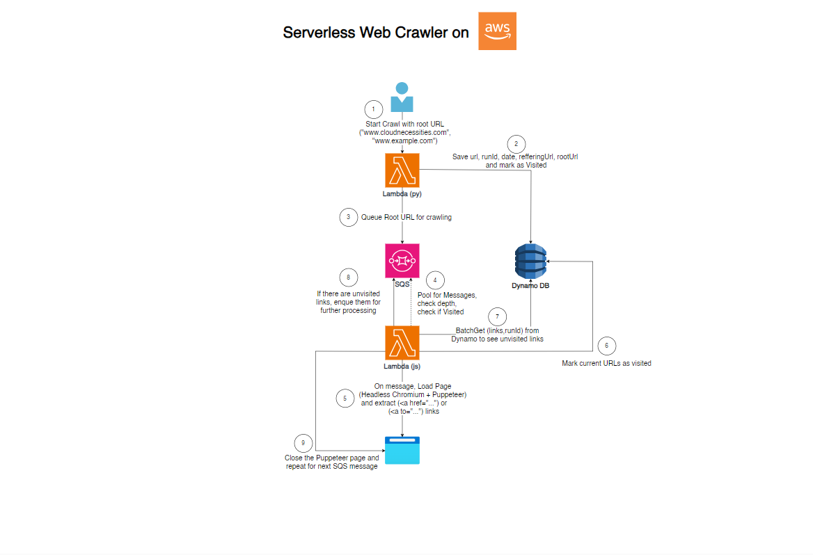

# 🕷️ Serverless Web Crawler on AWS

## 🎥 Demo Video
Watch the full crawler in action on LinkedIn:  
👉 [Watch Demo Video](https://linkedin.com/in/your-link)

A fully serverless web crawler that dynamically discovers and retrieves all unique internal links from a website — even those rendered on the client-side via React Router or other single-page app frameworks.

This project started as a hands-on exercise inspired by BeABetterDev’s Serverless Web Crawler. While the original concept shaped the architecture, I rewrote the Crawler Lambda in Node.js (replacing Python/Selenium with Puppeteer + Sparticuz Chromium) and solved multiple AWS Lambda-specific challenges, including layer size limits, dynamic React Router links, cold starts, and cost optimization.

Along the way, I applied AWS Lambda best practices learned from coursework and experimentation — including DLQs, throttling, concurrency tuning, and environment-based deployment with aliases.

- Supports static `<a href>` links & client-side React Router `<Link to="">` navigation
- Serverless & Scalable: Uses AWS Lambda, SQS, and DynamoDB
- Overcomes AWS limits: Fits Puppeteer + Chromium into Lambda’s 250MB restriction
- Optimized for cost and performance using AWS Step Functions

## Diagram



# My Journey: From Python to Node.js
This project began as an exercise to reinforce my AWS Lambda skills, inspired by the excellent work in BeABetterDev’s Python implementation.

I quickly hit AWS Lambda’s 250MB layer size limit when deploying Python/Selenium with headless Chromium. To overcome this:

I switched to Node.js and used Puppeteer + Sparticuz Chromium, optimized for Lambda environments.

## This meant:
- Rewriting the Crawler Lambda in Node.js from scratch
- Building separate Lambda layers for dependencies and Chromium
- Optimizing Puppeteer to block unnecessary assets (images, videos, fonts)
- Adding concurrency controls, depth limits, and fail-safes to keep the crawler within target domains

The result? A scalable, cost-efficient crawler that works perfectly with both static and dynamic websites.

## Tech Stack & AWS Services
``` bash
`Service`                   `Role`
AWS Lambda	                Initiator (Python) & Crawler (Node.js) functions
SQS & DLQ	                  Queuing system & error handling
DynamoDB	                  Tracks visited URLs to avoid duplicates
S3	Hosts                   React-based test websites for validation
CloudFront	                Handles cache invalidation for updated site content
CloudWatch	                Debugging and performance insights
Step Functions  	          Power tuning for Lambda cost/performance optimization
Puppeteer + Chromium      	Headless browser for crawling dynamic, client-rendered pages
```

## High-Level Workflow
1️⃣ User submits a root URL to the Initiator Lambda.
2️⃣ Initiator Lambda saves the URL in DynamoDB and enqueues it in SQS.
3️⃣ Crawler Lambda consumes SQS messages:

Loads the page using Puppeteer + Sparticuz Chromium.

Extracts all static <a href> and dynamic <Link to=""> links.

Checks DynamoDB for previously visited URLs.

Enqueues new URLs back into SQS.
4️⃣ Process repeats until all unique links are visited (with configurable max depth).
5️⃣ Results are stored in DynamoDB.

## Challenges I Solved
# 1. Lambda Layer Size Limit
AWS Lambda has a 250MB uncompressed layer limit. Switching from Python/Selenium to Node.js + Sparticuz Chromium solved this elegantly.

# 2. Dynamic Content Rendering
React Router links don’t exist in static HTML. Puppeteer renders the page and extracts them correctly.

# 3. Throttling & Fail-Safes
Refactored the crawler to stay within the target domain and avoid runaway crawls (e.g., crawling Facebook by accident). Controlled concurrency to avoid hitting Lambda throttling limits.

# 4. Cost Optimization
Used AWS Lambda Power Tuning (via Step Functions) to fine-tune memory and execution time for the best cost/performance tradeoff.

## Project Structure
``` bash
/initiator-lambda        # Python Lambda for starting the crawl
/crawler-lambda          # Node.js Lambda with Puppeteer + Chromium
/layers
  ├── python-layer       # Python dependencies for Initiator
  └── nodejs-layer       # Node.js dependencies for Crawler
/docs                    # Deployment guides and architecture notes
```

## 📸 Demo

✅ Crawled Localy : cloudnecessities.com


✅ Crawled: cloudnecessities.com


✅ Crawled: drugastrana.rs


(Results saved in DynamoDB tables with logs available in CloudWatch.)

## 📥 Getting Started
1️⃣ Clone this repo.
2️⃣ Follow the LAYER-INSTALLATION.md guide to set up Lambda layers for Python and Node.js dependencies.
3️⃣ Deploy the Initiator and Crawler Lambdas via S3 or AWS Console.
4️⃣ Start crawling by triggering the Initiator Lambda with a root URL.

## 🏆 Key Achievements
✅ Solved AWS Lambda cold-start & Puppeteer rendering delays
✅ Enabled crawling of React dynamic routes
✅ Designed for scalability: parallel Lambda executions
✅ Cost-optimized and production-ready

## 🧑‍💻 Author
👋 Milos Faktor
💼 LinkedIn • 🗂️ Portfolio

Special thanks to BeABetterDev for the original Python implementation.

📘 Want the full build journey with errors, fixes, lessons, and AWS tweaks?  
Check out the [BUILD-JOURNAL.md](docs/BUILD-JOURNAL.md)