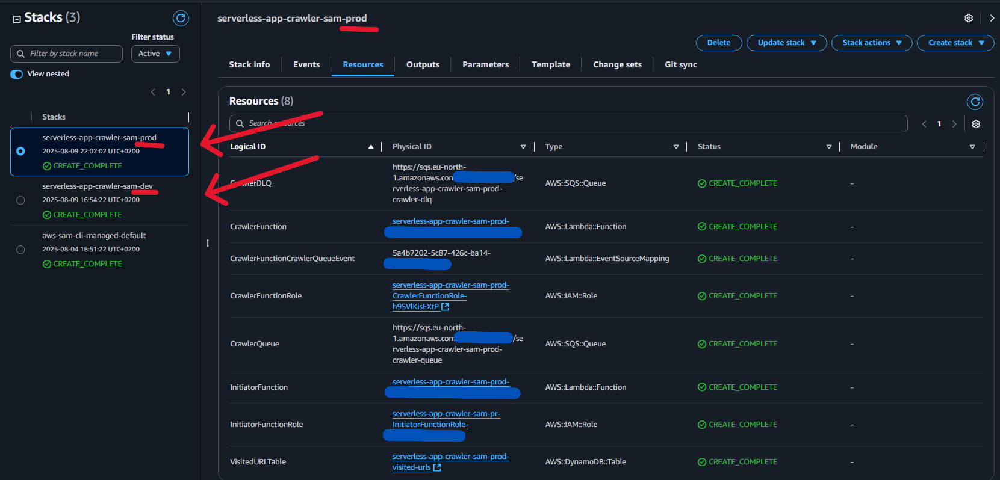

# 🚀 Serverless Web Crawler – Flagship CI/CD Pipeline

This is my **production-grade, end-to-end automation pipeline** for the Serverless Web Crawler project.  
It combines **Continuous Integration** and **Continuous Deployment** into a single GitHub Flow–driven workflow, ensuring production is always in a known-good, tested state.

⚠️ Disclaimer: The URL used in this demo is provided solely to showcase the functionality of this project. It will not work out-of-the-box when you clone the repository. I have permission to use the website shown in the demo, but you should configure your own target by setting an environment variable (e.g., ROOT_URL=<your_url>) in the Integration Test CodeBuild stage.

---

### Do you want to see all screenshots from the project?  
👉 [All screenshots](docs/screenshots/)

### Want the full deployment journey with errors, fixes, lessons, and AWS tweaks?  
👉 [BUILD-JOURNAL.md](docs/BUILD-JOURNAL.md)

---

## 📋 High-Level Overview

**Continuous Integration (CI)** runs for every Pull Request targeting `main`, deploying to a development environment, running integration tests, and requiring manual approval + GitHub status checks before merge.


**Continuous Deployment (CD)** triggers automatically after merge, promoting the tested CI artifacts directly to production, then cleaning up the development stack to prevent cost drift.


---

## 📋 CI/CD Pipeline Overview

| Stage | Name | Purpose |
|-------|------|---------|
| CI-1 | **Source** | Trigger from GitHub Pull Request events |
| CI-2 | **Build & Package** | Validate & package SAM artifacts |
| CI-3 | **Deploy to Dev** | Deploy stack to development environment |
| CI-4 | **Integration Testing** | End-to-end functional testing |
| CI-5 | **Manual Approval + Status Check** | Human gate + GitHub merge protection |
| CD-1 | **Source** | Trigger on push to `main` after CI success |
| CD-2 | **Deploy to Prod** | Deploy tested artifacts from CI |
| CD-3 | **Delete Dev Stack** | Clean up resources & avoid cost drift |

---

## 🔹 Why GitHub Flow

For this project’s scale, **GitHub Flow** struck the right balance between simplicity and safety:

- Clear separation between protected `main` branch and active `feature/*` branches.
- Merges to `main` require both CI pipeline success and manual approval.
- Lighter than GitFlow but with more control than trunk-based development.

**🧠 Key Insight:**  
Branch strategy isn’t just about organization — it’s a security and quality control layer for production.


---

## 🔹 GitHub Branch Protection + Status Checks

The main branch is fully locked down:

- ❌ No direct commits (even for admins)
- ✅ All merges require:
  1. Passing CI pipeline
  2. Manual approval in AWS CodePipeline
  3. GitHub status check posted via CodePipeline integration

**🧠 Key Insight:**  
Status checks turn CI into a **merge gate** — no green check, no merge.

---


# 🚀 CI Pipeline


## 🔹 CI – Step 1: Source (Pull Request Event Webhook)

### What I Did
- Connected CodePipeline to GitHub using an AWS CodeStar Connections integration (GitHub App authentication).
- Triggered from **pull request events** (not direct pushes).
- Filtered **destination branch** to `main`.
- Selected PR events:
  - **Created** (PR opened)
  - **Updated** (commits pushed to PR’s source branch)
- Left **Closed** unselected.

### Key Learnings
- PR event filtering is **destination-based**, not source-based.
- Once a PR is open, commits to the feature branch trigger CI automatically.
- Filtering to only “Created” & “Updated” keeps pipeline clean.

### Challenges & Fixes
- ❌ Pipeline didn’t trigger on feature branch commits initially.
- ✅ Fixed by setting destination branch filter to `main`.

### Outcome
- CI starts automatically for any PR → main.

---

## 🔹 CI – Step 2: Build & Package (CodeBuild)

### What I Did
- Minimal `buildspec.yml` that:
  1. Validates the SAM template.
  2. Runs `sam build` → `.aws-sam/build/`.
- Exported only required artifacts for later stages.

### Why Split Build & Deploy
- **One SAM template** for all environments, controlled by `STAGE=dev|prod`.
- Deploy stage injects env-specific params at runtime without rebuilding.

### Key Learnings
- Artifacts = “handoff contract” for later stages.
- Clean rebuilds keep template/code in sync.
- Using preinstalled runtimes saved ~30s build time.


---

## 🔹 CI – Step 3: Deploy to Dev

### What I Did
- Dedicated `deploy.sh` script:
  - Validates stack status before deploy.
  - Deletes failed stacks automatically.
  - Runs `sam deploy` with env-specific settings.
  - Saves CloudFormation outputs (full + simplified JSON).

### Challenges
- **IAM Permissions:** Separate Dev/Prod roles.
- Handling **ROLLBACK** states without blocking future deploys.

### Outcome
- Dev stack deployed cleanly, ready for integration testing.


---

## 🔹 CI – Step 4: Integration Testing

### Purpose
Full end-to-end verification that:
1. Initiator Lambda → SQS → Crawler Lambda → DynamoDB works as expected.

### What Happens
- Load stack outputs from artifacts.
- Invoke Initiator Lambda with `fileb://` payload.
- Wait 30s before polling SQS (avoids race conditions).
- Poll SQS until empty (with 3 consecutive empty checks).
- Scan DynamoDB table → must have ≥1 record to pass.

### Challenges
- Missing artifacts between stages → fixed by explicit artifact listing.
- `fileb://` vs `file://` payload encoding.
- Timing logic to avoid false negatives.

### Outcome
- Reliable functional gate before production.


---

## 🔹 CI – Step 5: Manual Approval, SNS Notification & GitHub Status Check

### What I Did
- Added **Manual Approval** action.
- Linked to **SNS topic** → email notification with:
  - Link to PR
  - Link to CodePipeline approval page
- Added post-approval CodeBuild job:
  - Posts `"success"` to GitHub Status API.
  - Uses `GITHUB_TOKEN` from Secrets Manager.

### How it Works
- PR → Build → Deploy → Test → **Approval** → Status Check → Merge
- **Merge button locked** until:
  1. Pipeline passes.
  2. Manual approval given.
  3. Status check posts successfully.


# 🚀 CD Pipeline


## 🔹 CD – Step 1: Source (Push to Main Trigger)

### What I Did
- Configured AWS CodePipeline (CD) to **trigger only on push events to the `main` branch**.
- This stage runs only after:
  1. CI pipeline completes successfully.
  2. Manual approval is granted.
  3. GitHub Status Check passes.
- Authentication via **GitHub App** (same as CI) for secure integration.

### Key Learnings
- CI and CD separation is critical:
  - CI = validate & approve code.
  - CD = deploy already approved code.
- Push-to-main trigger guarantees production uses a **known good commit**.

### Outcome
- Acts as the **entry point** for production deployment.
- Ensures only tested, approved, and reviewed code reaches production.


---

## 🔹 CD – Step 2: Deploy to Production

### What I Did
- Reused the same **`deploy.sh`** and **`buildspec-deploy.yml`** as the Dev stage in CI.
- Changed environment variables to target `prod`:
  - `Environment=prod`
  - `STACK_NAME=serverless-webcrawler-$Environment`
  
- Used a **separate IAM role** for production with stricter permissions.
- Fully automated `sam deploy --no-confirm-changeset`.

### Key Learnings
- **Artifact promotion**: Used Dev build artifacts directly for Prod deploy to ensure **bit-for-bit identical code**.
- **Separate IAM roles** per environment to reduce blast radius.
- Unique stack names prevent accidental overwrites.

### Challenges & Fixes
- **Artifact Passing**:
  - Initially tried creating a custom S3 bucket for artifacts.
  - Discovered CodePipeline’s own managed S3 bucket already stores them.
  - Located artifact path via **View Artifacts** in the Dev Build stage and configured Prod deploy to pull directly from it.
- Result: **Prod always deploys the same tested code from Dev**.

### Outcome
- Predictable, reproducible deployments.
- No accidental resource overlap.
- Fully automated and hands-off once triggered.





---

## 🔹 CD – Step 3: Dev Stack Deletion

### What I Did
- Added a cleanup stage to **delete the Dev stack** after a successful Prod deployment.
- AWS CLI in CodeBuild:
  ```bash
  aws cloudformation delete-stack --stack-name "$STACK_NAME"
  aws cloudformation wait stack-delete-complete --stack-name "$STACK_NAME"
  ```

### Key Learnings
- Automated cleanup avoids resource drift and cost leaks.
- `aws cloudformation wait` ensures deletion finishes before pipeline exit.
- IAM permissions must allow all delete actions for stack resources.

### Challenges & Fixes
**Event Source Mappings**  
- Deletion failed due to Lambda SQS triggers still attached.  
- Added `lambda:ListEventSourceMappings` & `lambda:DeleteEventSourceMapping` to cleanup script.

**IAM Permissions**  
- Added required delete permissions for Lambda, SQS, DynamoDB, and CloudFormation resources.

### Outcome
After each merge to `main`:
1. Prod stack is deployed from tested Dev artifacts.
2. Dev stack is deleted automatically.

**Result:** Clean AWS account, no cost drift, and Dev ready for the next branch.


---

## ✅ Final Flow Summary

feature/* → Pull Request → **CI Pipeline**:  

1. Source Trigger  
2. Build & Package  
3. Deploy to Dev  
4. Integration Tests  
5. Approval + Status Check 

→ Merge to main → **CD Pipeline**:  

6. Deploy to Prod  
7. Delete Dev Stack

---

## 📦 Skills & Knowledge Demonstrated

- GitHub Flow + Branch Protection
- AWS CodePipeline / CodeBuild multi-stage CI/CD
- SAM packaging & multi-environment deployments
- Integration testing with async AWS services
- GitHub Status API integration
- SNS notifications in pipeline workflows
- Artifact promotion for reproducible deployments
- Automated CloudFormation stack cleanup

---

## 👤 Author
**Milos Faktor** — [LinkedIn](https://www.linkedin.com/in/milos-faktor-78b429255/)

---

## 🔖 Hashtags
#AWS #CodePipeline #CodeBuild #AWSSAM #CI_CD #DevOps #GitHubFlow #BranchProtection #StatusChecks #ArtifactPromotion #InfrastructureAsCode #Serverless #Lambda #SQS #DynamoDB #Automation #CloudComputing #WebCrawler
