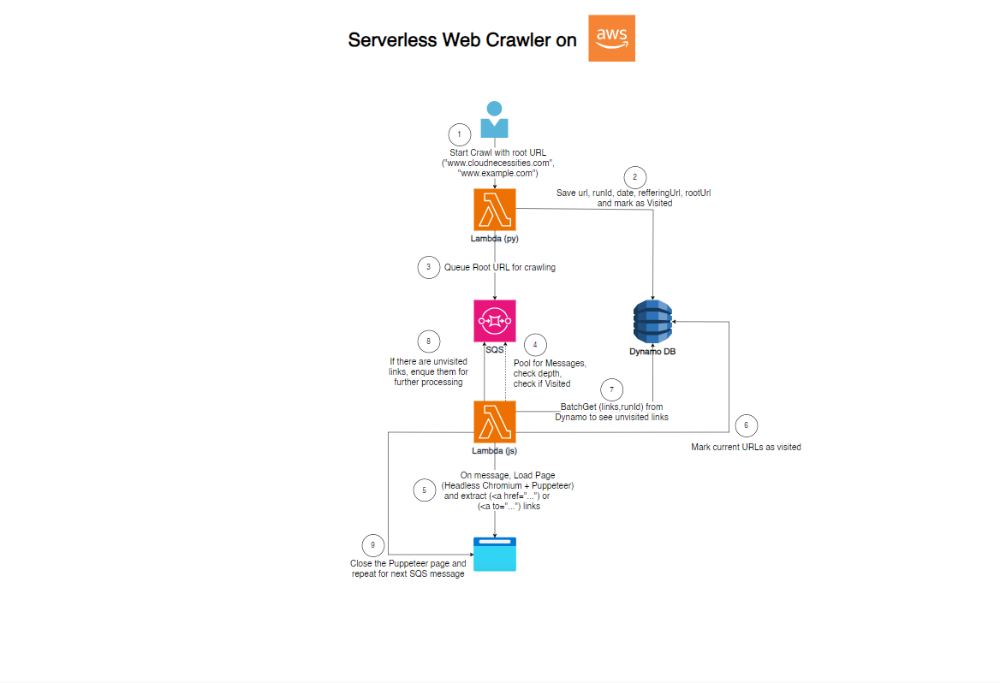

# 📓 BUILD-JOURNAL.md – Serverless Web Crawler (Version 2)

This journal documents the complete journey of developing **Version 2** of the Serverless Web Crawler using AWS SAM, Node.js, and Python. It expands on the earlier version by introducing better automation, concurrency tuning, and layered local development.

---

## 🧠 Architecture Diagram



## 🛠️ PHASE 1: Preparing the Repo & SAM Setup

### 🔹 Objective
Rebuild the previously working crawler from scratch using **AWS SAM (Serverless Application Model)** for improved versioning, automation, and deployment consistency.

### 🔹 Project Structure Created

```bash
./README.md 
./docs
└── BUILD-JOURNAL.md
./serverless-app-sam
├── Crawler Lambda
│   ├── index.mjs
│   ├── package.json            # Node.js dependencies including Puppeteer
│   ├── utils.mjs
│   └── visitedURL.mjs
├── Initiator Lambda
│   ├── initiator.py
│   ├── models
│   │   ├── VisitedURL.py
│   │   └── __init__.py
│   ├── requirements.txt        # Python dependencies
│   └── utilities
│       ├── __init__.py
│       └── util.py
├── __init__.py
├── events
│   └── event.json          # Sample event for local testing of Initiator Lambda / needs to be changed
├── samconfig.toml            # SAM configuration file
└── template.yaml               # SAM template defining the infrastructure
```

## ⚙️ PHASE 2: SAM Deployment

### 🔹 Build
```bash
cd serverless-app-sam/
sam build
```


- Automatically packaged Python and Node.js functions using `requirements.txt` and `package.json`.

### 🔹 Deploy
```bash
sam deploy --guided
```


### Setting default arguments for 'sam deploy'
        =========================================
        Stack Name [serverless-app-crawler-sam]: ***"Enter your stack name"/"press Enter for default"***
        AWS Region [eu-north-1]: ***"Enter your region"/"press Enter for default"***
        #Shows you resources changes to be deployed and require a 'Y' to initiate deploy
        Confirm changes before deploy [Y/n]: Y
        #SAM needs permission to be able to create roles to connect to the resources in your template
        Allow SAM CLI IAM role creation [Y/n]: Y
        #Preserves the state of previously provisioned resources when an operation fails
        Disable rollback [y/N]: N
        Save arguments to configuration file [Y/n]: Y
        SAM configuration file [samconfig.toml]: ***"Enter your config file"/"press Enter for default"***
        SAM configuration environment [default]: ***"Enter your config environment"/"press Enter for default"***

        At the end of the deployment, you will see: Deploy this changeset? [y/N]: y

       


- Provided stack name, region, S3 bucket, capabilities.
- IAM roles created and connected.
- Successfully deployed full infrastructure:
  - Initiator Lambda
  - Crawler Lambda
  - SQS Queue
  - DLQ
  - DynamoDB
  - IAM Roles

---

## 🕸️ PHASE 3: Crawling Behavior & Concurrency

### 🔹 Reserved Concurrency
```yaml
ReservedConcurrentExecutions: 1  # Initiator Lambda

ReservedConcurrentExecutions: 5  # Crawler Lambda
```

- This fixed many parallel execution issues in Crawler Lambda while testing and debugging.

---

## 📁 PHASE 4: Versioning & Git

### 🔹 Git Branching Strategy
- Used `main` for latest stable version.
- Created `v1`, `v2`, `crawler-dev` branches.
- Committed code regularly during SAM testing phases.

## ✅ PHASE 5: Deployment Outcome

### 🔹 Successfully Crawled:
- `drugastrana.rs` 

All links saved to DynamoDB.
Crawler gracefully shut down after max depth.
CloudWatch showed optimized Lambda runtimes (39.5s - COLD ).

## Screenshots

 


---

## 🧠 LESSONS LEARNED

- ✅ SAM automatically installs Python/Node dependencies — no need for CodeBuild.
- ✅ Using `sam build` and `sam deploy` simplifies the process.
- ✅ Node.js + Puppeteer + Sparticuz Chromium beats Python + Selenium on AWS Lambda.
- ✅ DLQ config is essential to capture failed crawls.
- ✅ Using `sam local invoke` is perfect for testing individual Lambdas.

---

## ⚠️ ETHICAL NOTICE

> This crawler is for **educational/demo use only**.  
> Do **not** crawl external websites repeatedly without permission.  
> Example sites used (e.g., drugastrana.rs) were crawled minimally.  

### ❗️Domain Scope & Caution

- The crawler is hard-coded to **only stay within the root domain** provided in the test event (e.g., `example.com`).  
- It will **not follow external links** (e.g., YouTube, Google, etc.).
- You can configure the crawl depth using the `MAX_DEPTH` environment variable.  
  - Example: `MAX_DEPTH=2` limits crawling to two levels deep.

🛑 Do not crawl high-traffic or sensitive websites without **explicit permission**.

This project is designed for safe experimentation on **your own site** or small test environments only. In future versions, additional safeguards like **rate limiting** or **IP throttling** may be added.

---

## 🛣️ FUTURE PLANS

- Add API Gateway trigger for user input (root URL)
- Add IP-based rate limiting (via API Gateway or Lambda throttling)
- Create CI/CD pipeline for automated deployments

---

## 🔗 SAMPLE USAGE (Local Dev)

```bash
sam build
sam deploy --guided

sam local invoke InitiatorFunction --env-vars .env.json -e events/test-event.json
sam local invoke CrawlerFunction --env-vars .env.json -e events/test-event-crawler.json
```

Trigger `InitiatorFunction` manually with a test event.

---

## 🧑‍💻 AUTHOR

👋 Milos Faktor  
🔗 [LinkedIn](https://www.linkedin.com/in/milos-faktor-78b429255/)  
🧠 AWS | Serverless | AI Integration

### Do you want to see all screenshots from the project?  
👉 [All screenshots](docs/screenshots/)

---

#AWS #Serverless #AWSSAM #LambdaFunctions #WebCrawler #CloudComputing #Python #NodeJS #Puppeteer #DynamoDB #SQS #CloudWatch #DevOps #InfrastructureAsCode #CICD #BuildInPublic #LearningInPublic #AIIntegration #DeveloperJourney #OpenSource #CloudD

